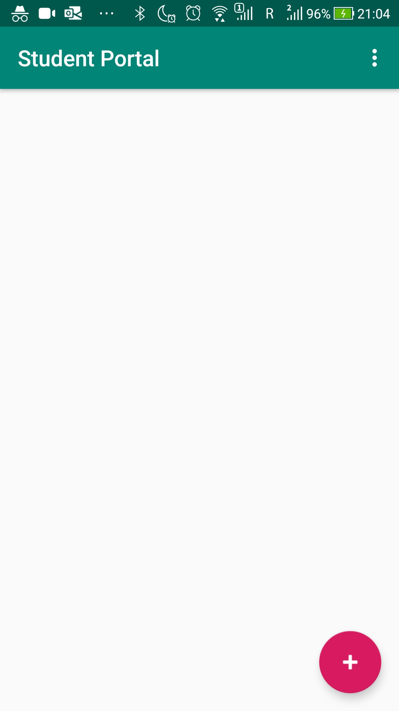
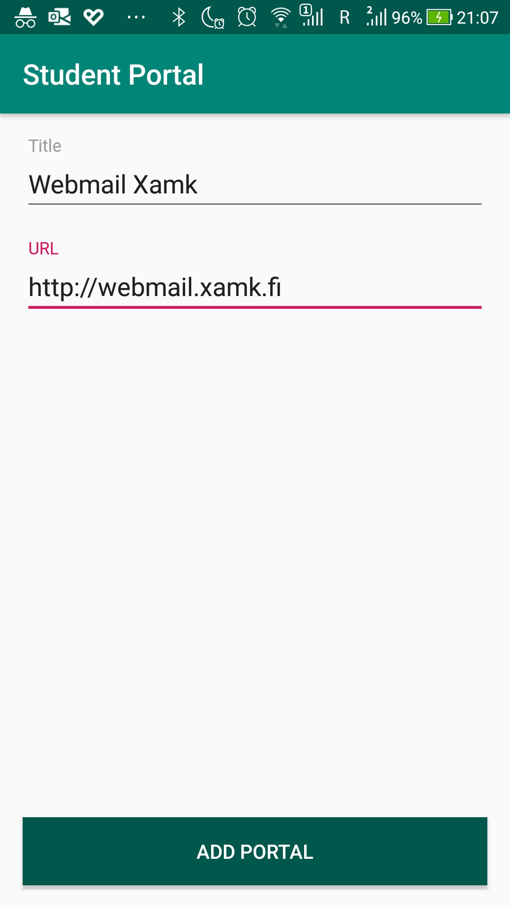
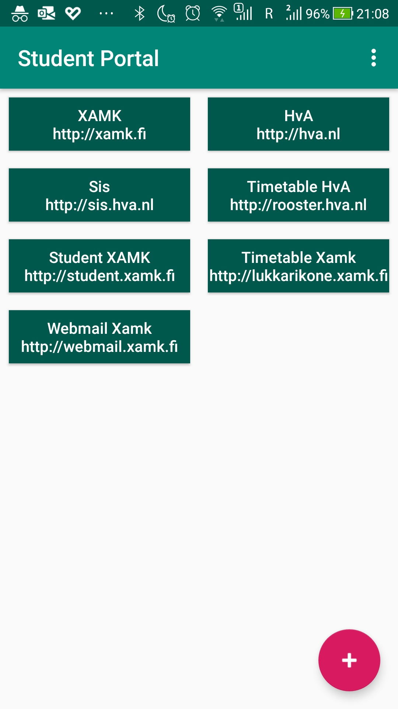
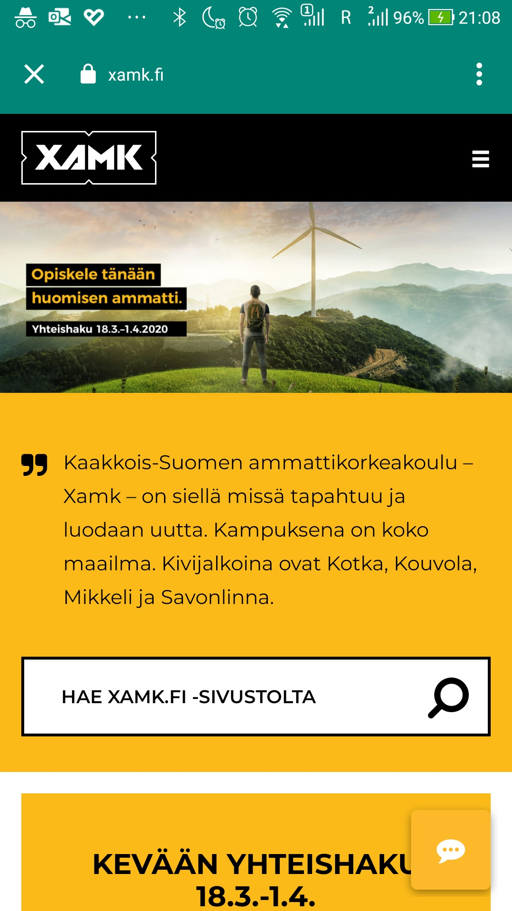

# Level 3 Learning Task 2 - Student portal
This is the second learning task of the third level. This task was more challenging because I had to do everything myself, without a tutorial. However, it was not that hard thanks to the skills acquired in the previous tasks.
## What's inside
This is an application where you can manage all the portals (websites) you need for your study: a RecyclerView is used to manage this list. The other screen is responsible for adding a portal. Custom Chrome Tabs are used to open the website on button click, I have also set the color of the tab to colorPrimary of our theme.
## Screenshots
    
    
